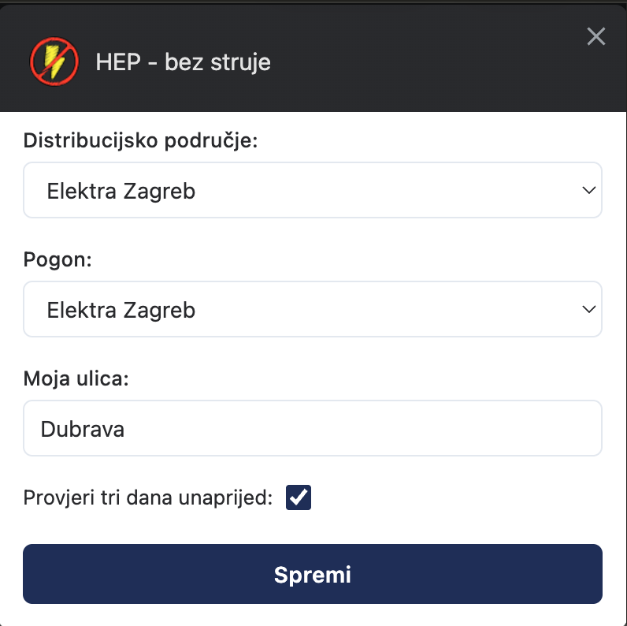
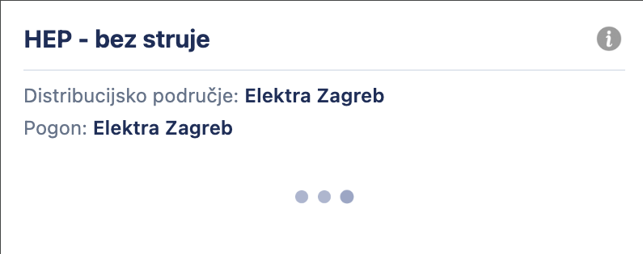
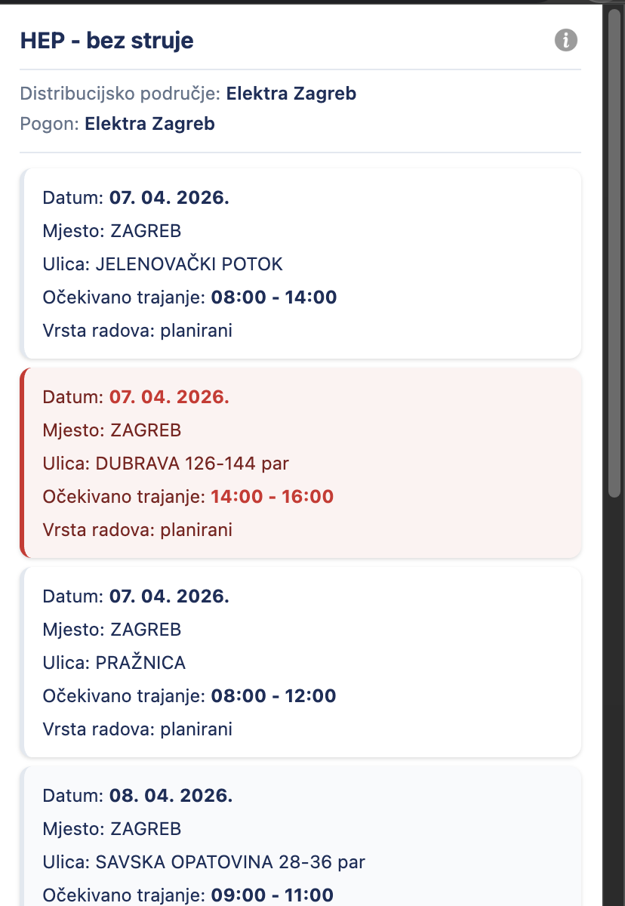
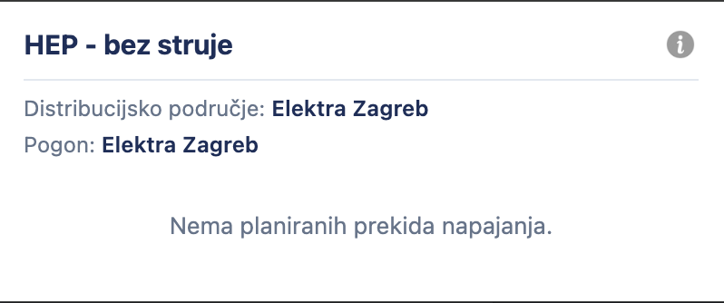

# Hep - bez struje


[](https://github.com/dineeek/hep-bez-struje/actions/workflows/lint-test-build.yml)
[](https://github.com/prettier/prettier)


Unofficial HEP Chrome extension for checking areas without electric power. Based
on HEP web page data scraping, TypeScript & React.

## Download

Available at
[**Chrome Web Store**](https://chrome.google.com/webstore/detail/hep-bez-struje/hahhmkkofmofnadefiadmpmcencoaljf).


## Screenshots

| Settings                                       | Loading                                      | Notification list                                   | No notifications                                         |
| ---------------------------------------------- | -------------------------------------------- | --------------------------------------------------- | -------------------------------------------------------- |
|  |  |  |  |

## Features

- Showing areas without electrical power per selected area and station
- Storing user selected distribution area and power station
- Highlighting expected power outage for user street
- Up to three days future date search
- Automatic retry on network failures
- Available localization:
  - German
  - English
  - Croatian
  - Hungarian
  - Slovenian

## Tech Stack

- React 18 with TypeScript 5
- Vite 8 with @crxjs/vite-plugin
- Vitest for testing
- ESLint + Prettier for code quality
- Chrome Extension Manifest V3

## Development

```bash
npm install    # install dependencies
npm run dev    # start dev server
npm run build  # production build to dist/
npm run test   # run tests
npm run lint   # check formatting and lint
```

## Permissions

The extension needs permissions for storing user options preferences.

## Contributing

Contributions and upgrade ideas are welcome!

## License

MIT License

Copyright (c) 2026 Dino Klicek
